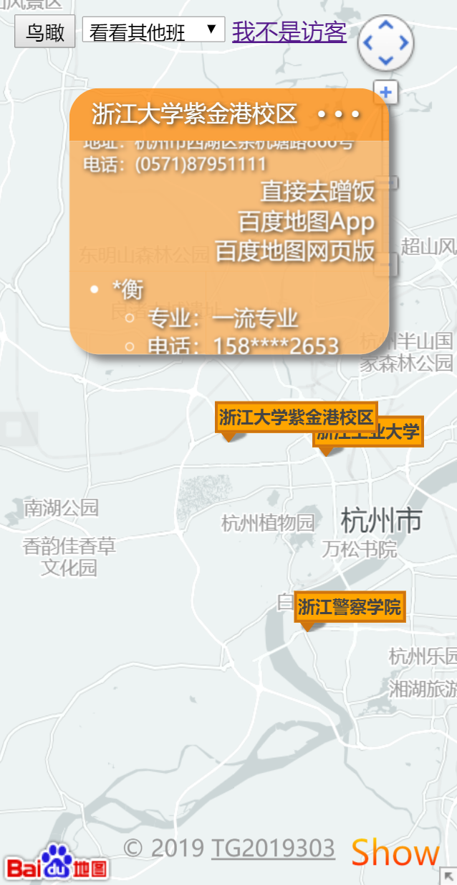
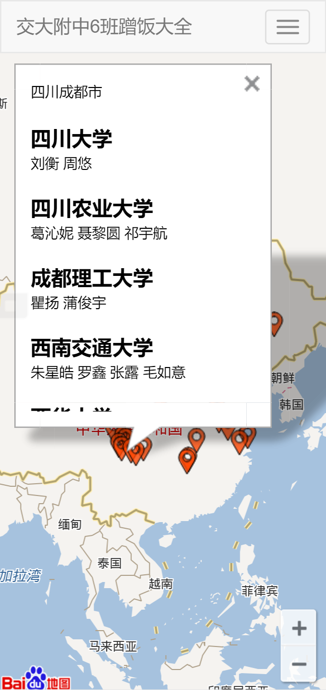
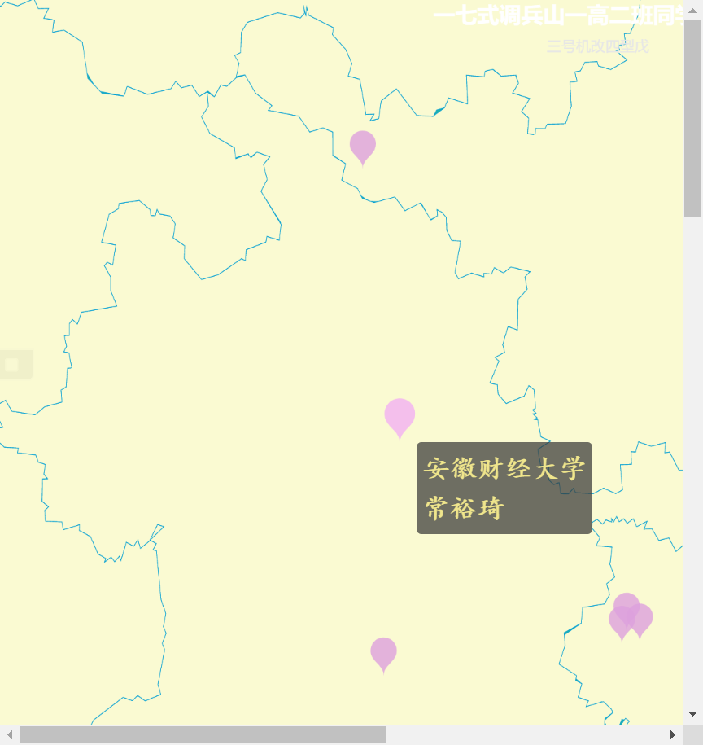
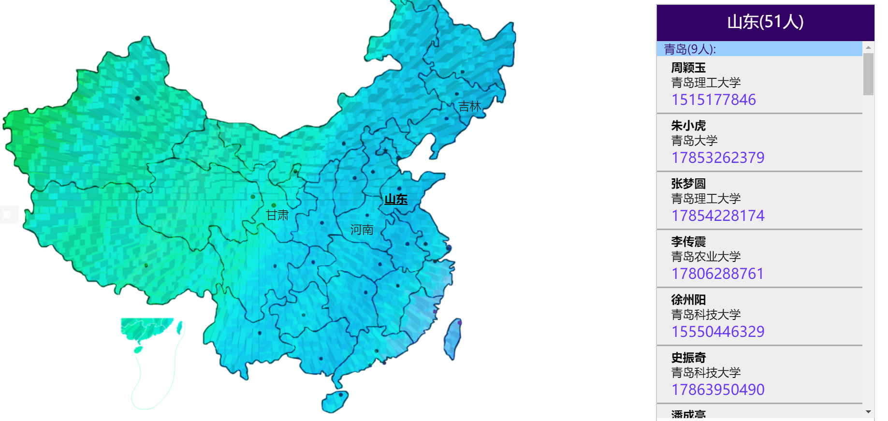
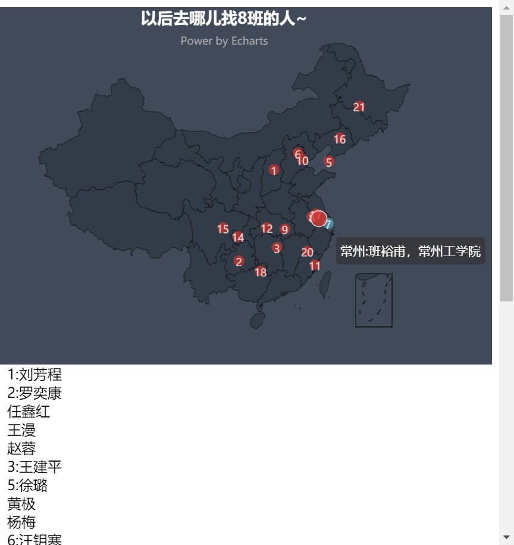
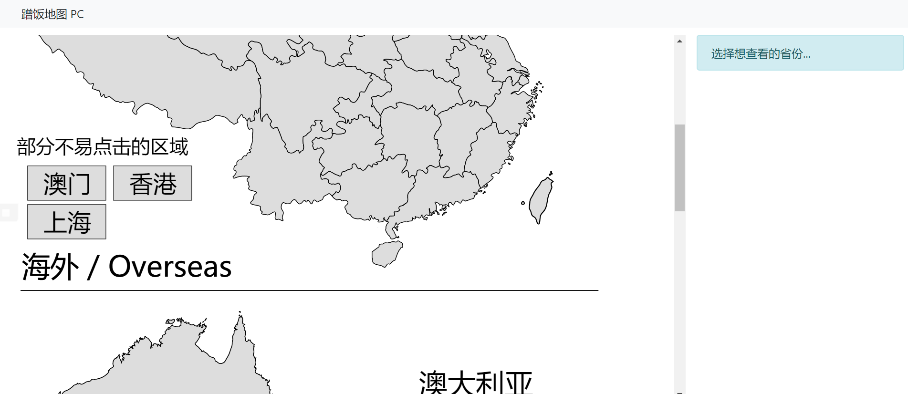

# 动态蹭饭图制作指北

厌倦了千篇一律的静态蹭饭图？来看看各家动态蹭饭图是怎么做的吧！

各家的英文译名千奇百怪，不要指望什么关键词比“蹭饭图”好用:grin:

如果有未收录的，欢迎Issue和PR

---

以下是各种动态蹭饭图的链接，注意看英文译名哦！

- <https://github.com/tg2019303/TG2019303.github.io>
    - **Distribution Map**
    - 主打移动端和信息加密
    - 不是我说，楼下白底黑字的信息窗口是百度地图自带的。
    - 示例网页：<https://tg2019303.github.io/>
    - 

- <https://github.com/yuehaowang/irmap>
    - Ideal Reality Map, a tool for generating **whereabouts map** of high school graduates
    - 示例网页：<http://wyh.wjjsoft.com/apps/6map/>, <https://github.com/Kaleidoblood/xty-apps>
    - 

- <https://github.com/jackhhh/SDFZ.ContactMap>
    - **Contact Map**
    - 师大附中2011级蹭饭地图，运行环境PHP+MYSQL
    - 示例网页：打不开的
    - 那为什么加进来？PHP+MYSQL，动态网页，要服务器啊，务器啊，啊！

- <https://github.com/Heriyadi235/17dbsyg2cft>
    - 一七式调兵山一高二班蹭饭图
    - **cft**（简洁明了）
    - 示例网页：<https://heriyadi235.github.io/17dbsyg2cft/>
    - 

- <https://gitee.com/joenahm/102>
    - 这倒好，只是一个班名
    - 示例网页：<http://joenahm.gitee.io/102/>
    - 

- <https://gitee.com/equation/freeloadMap>
    - **freeloadMap** 我*uc*（你懂就好）
    - 

- <https://github.com/outloudvi/mmp>
    - 蹭饭地图 - Meal MaP~~话说mmp好像不太干净~~
    - 恕我点不出任何效果。。
    - 示例网页：<https://outv.im/mmp/#/>
    - 