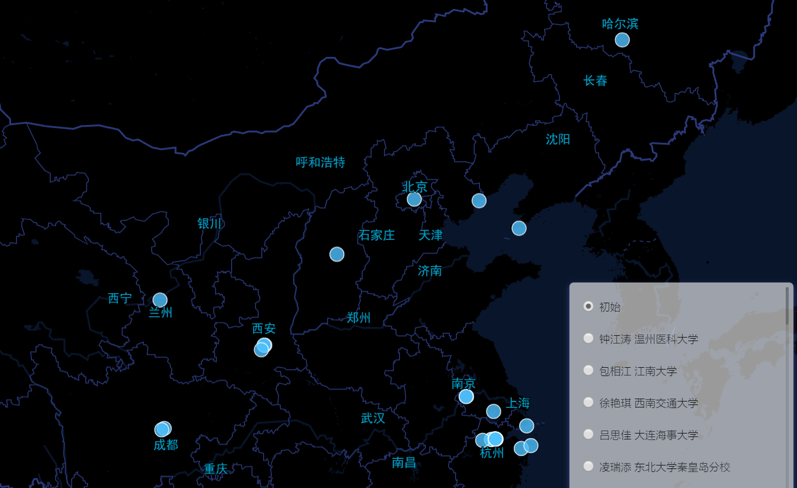
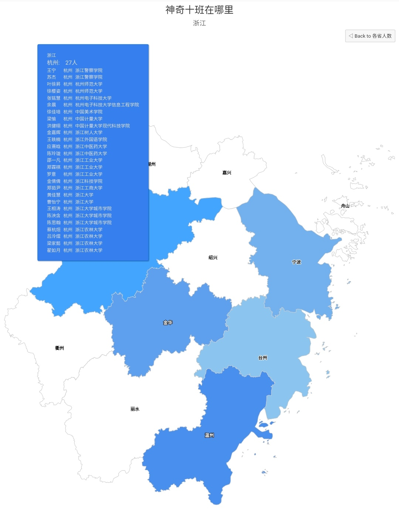
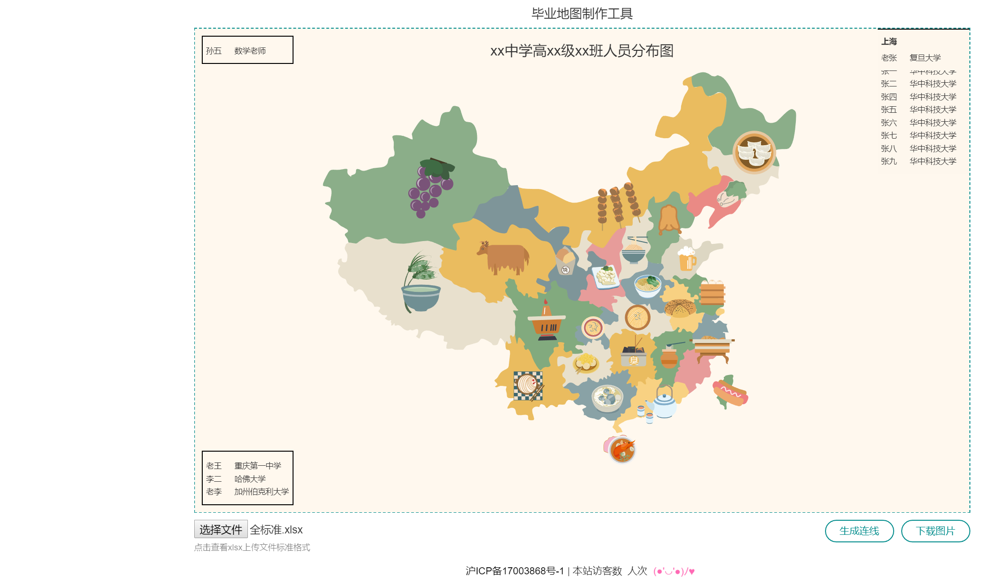
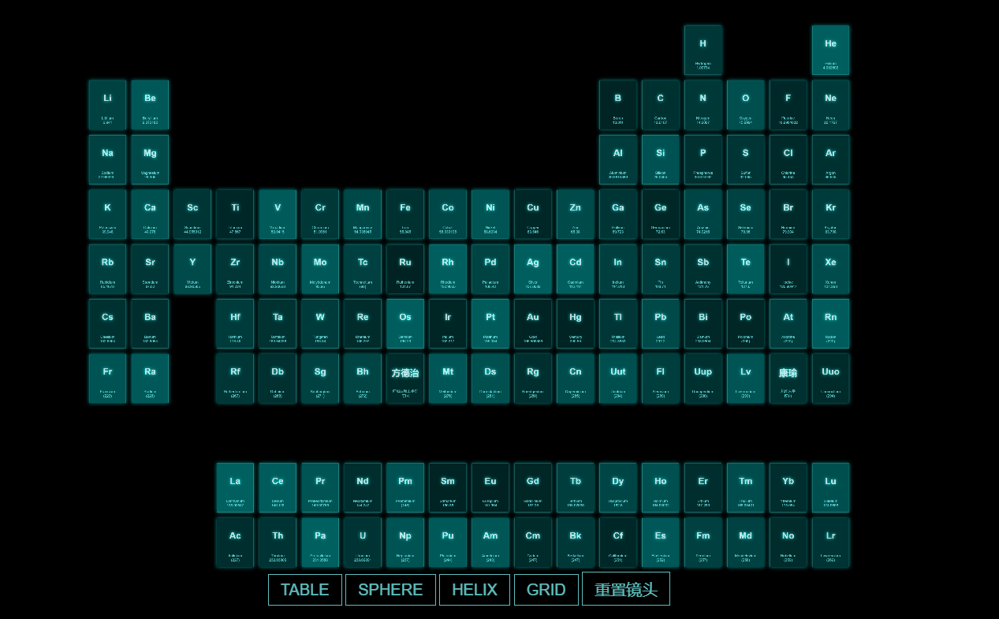

# 动态蹭饭图制作指北

[English](#english-version)

厌倦了千篇一律的静态蹭饭图？来看看各家动态蹭饭图是怎么做的吧！

各家的英文译名千奇百怪，不要指望什么关键词比“蹭饭图”好用:grin:

如果有未收录的，欢迎Issue和PR

---

以下是各种动态蹭饭图的链接，注意看英文译名哦！

- <https://github.com/tg2019303/TG2019303.github.io>
    - 2019届
    - **Distribution Map**
    - 主打移动端和信息加密
    - 不是我说，楼下白底黑字的信息窗口是百度地图自带的。
    - 示例网页：<https://tg2019303.github.io/>
    - 
- <https://github.com/yuehaowang/irmap>
    - 2017届
    - Ideal Reality Map, a tool for generating **whereabouts map** of high school graduates
    - 示例网页：<http://wyh.wjjsoft.com/apps/6map/>, <https://github.com/Kaleidoblood/xty-apps>
    - 
- <https://github.com/PillarsZhang/Map-of-Graduation-Direction>
    - 浙江省春晖中学2019届11班毕业去向
    - 示例网页：<https://h5.app.pizyds.com/chzx-2019-11-byqx/>
    - 
- <https://github.com/jackhhh/SDFZ.ContactMap>
    - 2017届（没有搞错，这个应该是初高中在一起）
    - **Contact Map**
    - 师大附中2011级蹭饭地图，运行环境PHP+MYSQL
    - 示例网页：打不开的
    - 那为什么加进来？PHP+MYSQL，动态网页，要服务器啊，务器啊，啊！
- <https://github.com/Heriyadi235/17dbsyg2cft>
    - 2017届，2018年也有更新
    - 一七式调兵山一高二班蹭饭图
    - **cft**（简洁明了）
    - 示例网页：<https://heriyadi235.github.io/17dbsyg2cft/>
    - 
- <https://gitee.com/joenahm/102>
    - 时间可疑，只存有2019-06-17 21:14的一次提交
    - 这倒好，只是一个班名
    - 示例网页：<http://joenahm.gitee.io/102/>
    - 
- <https://gitee.com/equation/freeloadMap>
    - 2017届
    - **freeloadMap** 我%&$=（你懂就好）
    - 示例网页：不存在的，弄到本地看吧！
    - 
- <https://github.com/outloudvi/mmp>
    - 2018届
    - 蹭饭地图 - Meal MaP~~话说mmp好像不太干净~~
    - 恕我点不出任何效果。。
    - 示例网页：<https://outv.im/mmp/#/>
    - 
- <https://github.com/SunsonMiddleSchool/2018class10-Graduation-Map>
    - 台州市书生中学2018届毕业生10班去向图（**Graduation Map**）
    - 示例网页：<https://map.gogo.moe>
    - 
- <https://github.com/podiumdesu/graduationMap>
    - 2017届
    - make a map about classmates' admission schools
    - 这只是一个静态蹭饭图生成工具
    - 示例网页：<http://map.petnakanojo.com/>（打不开的，估计域名过期了）
    - 
- <https://github.com/test2g/Graduation-Map>
    - 2017届
    - 喜欢node.js的可以去看看啊！
- <https://github.com/andyfangdz/whereabouts>
    - **Whereabouts map** for Class 13 - 2015
    - 这家伙怎么只显示了2个人。。
    - 示例网页：<http://publicservice.andyfang.me/>（打不开的，估计域名过期了）
    - 

# English version

I am too lazy to write a full English version, because after all, this maybe the tradition only among Chinese high school students.

But at least I want to explain what  蹭饭图 means in English. 

About one month after College Entrance Examination (June 7th. 8th. 9th), we know where to spend next four years or so as a university student. And then we make a map indicating how classmates distribute all over China. Usually the map is static, just a picture, thus the information is limited. But once made into a web page, you cannot have too much  information to display: major, phone numbers,  photos and attachments and so on.
